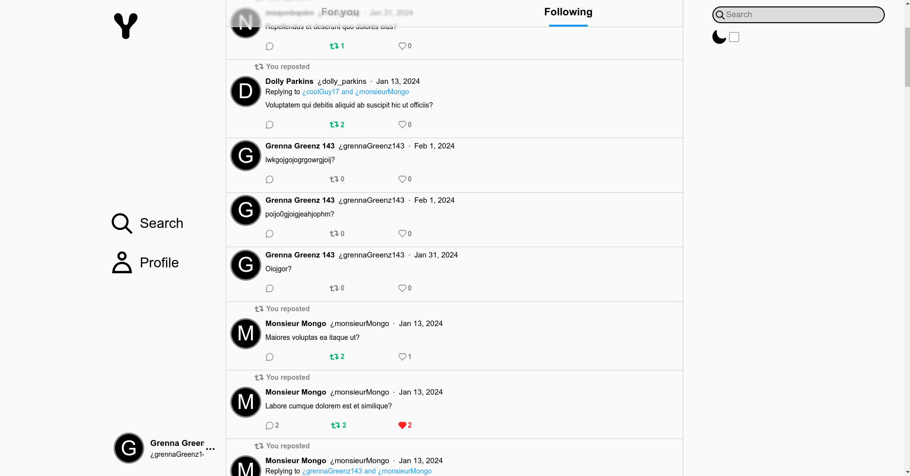
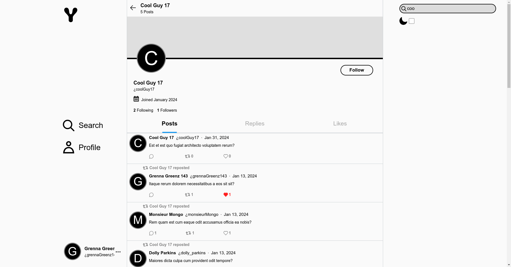
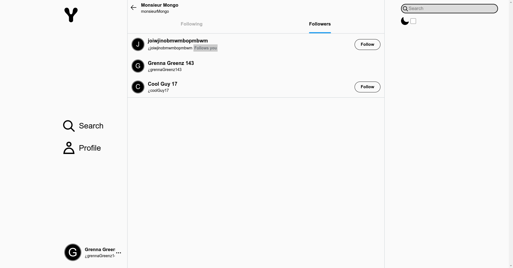
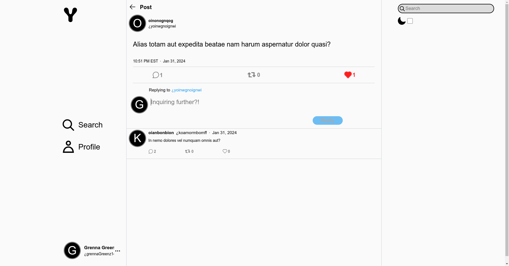
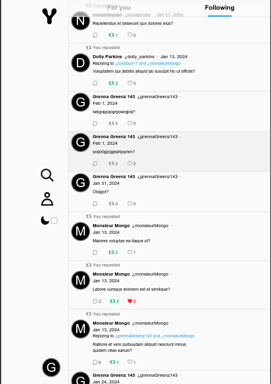
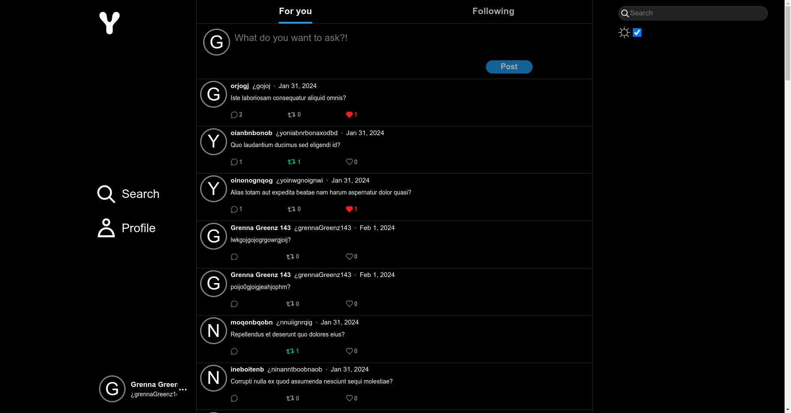
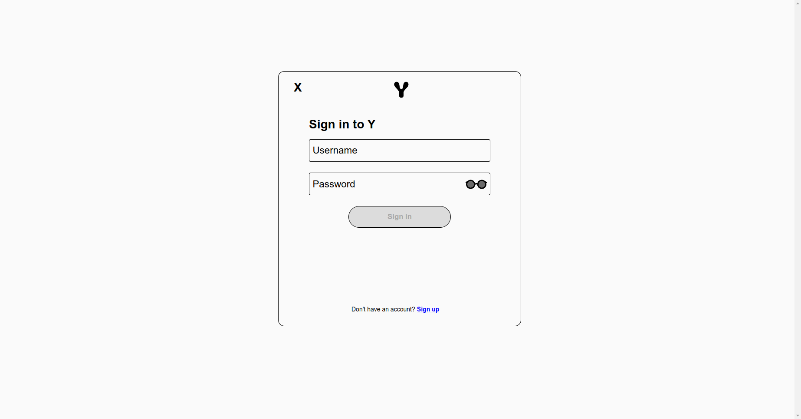

# Y (Client)


[Y](https://why-client-6472abb311a5.herokuapp.com/) is a platform for posting questions and asking more. Users can create posts and comments as long as they're all questions, encouraging deeper thought. Users can also follow each other and like and repost posts and comments. Posts and highly reposted comments are aggregated onto the front page. For a currated list, a user can view a front page of their followed users.

Installation
===================

Requires [node](https://nodejs.org/en/download) and [yarn](https://classic.yarnpkg.com/lang/en/docs/install/#debian-stable)

```sh
# Install packages
yarn
```

### Run Server

```sh
yarn start
```

### Lint (via Rubocop)
```sh
yarn lint
```

### Run without launching browser
```sh
yarn start-nb
```

Features
===================

## Familiar Design









## Mobile Responsive



## Dark Theme



## Auth Management

